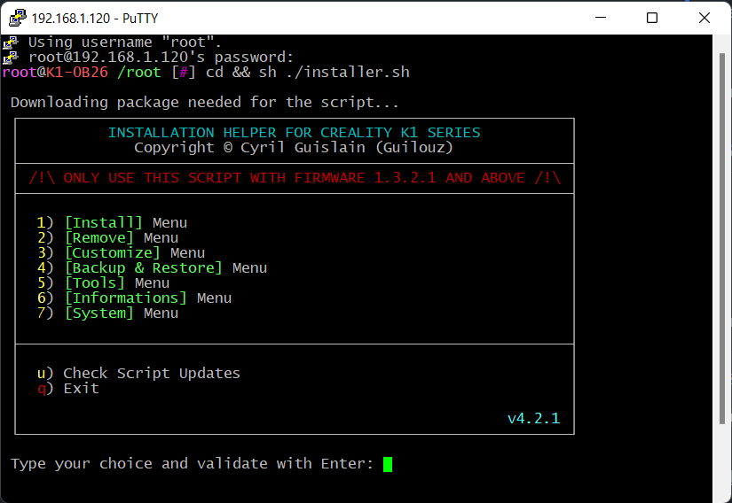
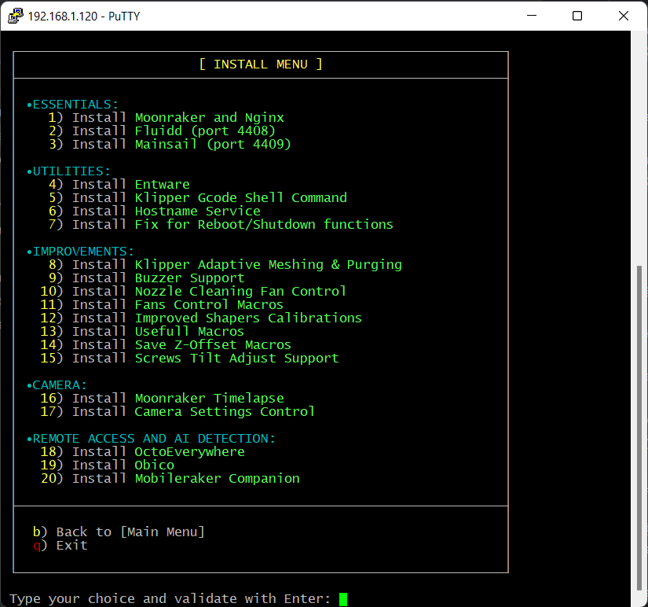
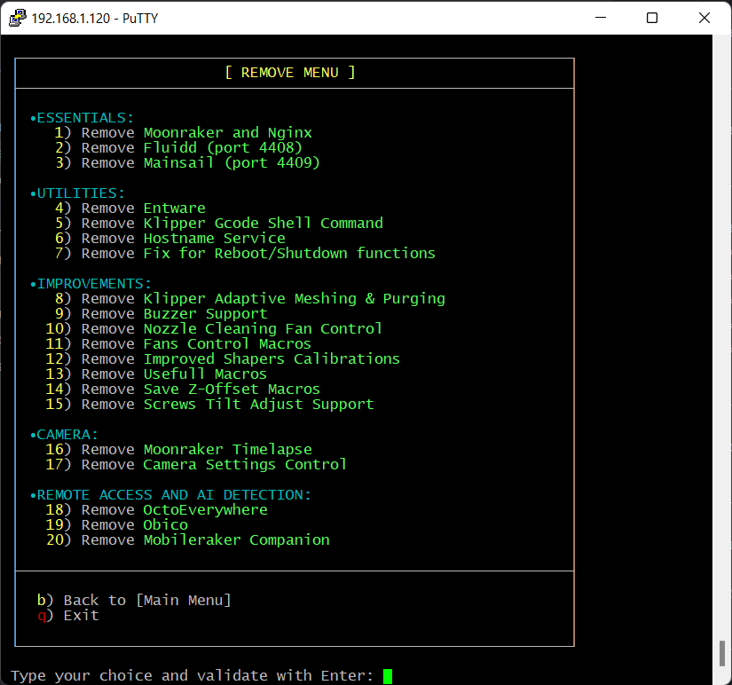
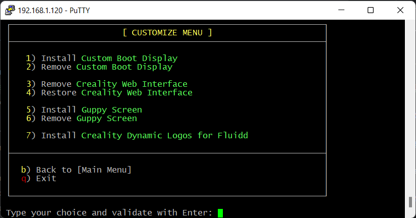
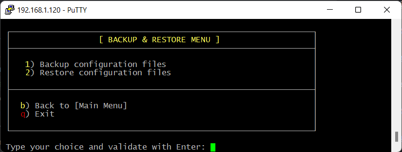
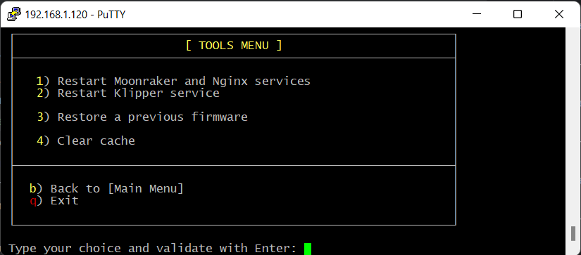
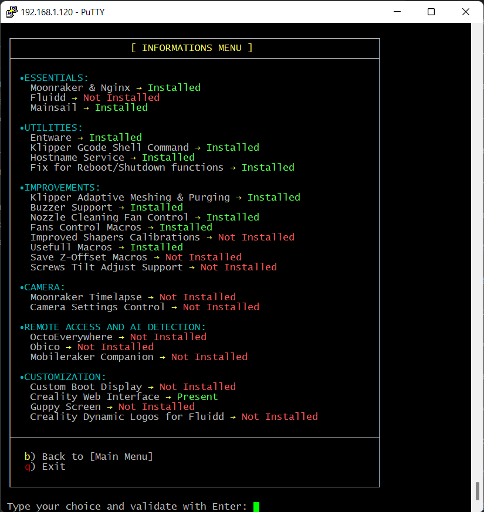
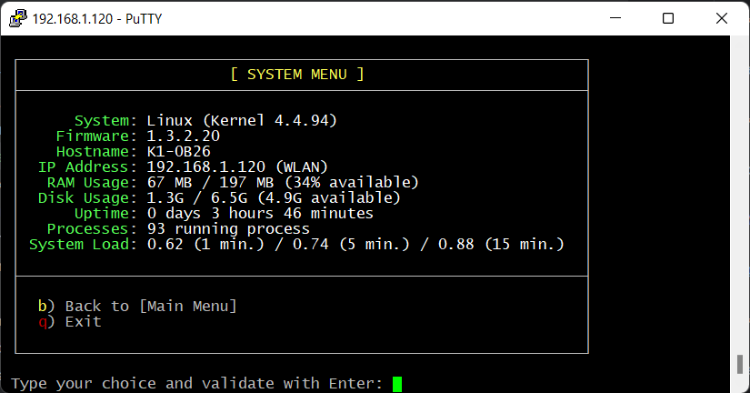

# Запуск и обновление Installation Helper Script

Installation Helper Script позволяет после получения [root доступа](root.md) и подключению к принтеру по [SSH](ssh.md), 
установить кастомные веб интерфейсы (Fluidd, Mainsail), а так же установить остальные полезные дополнения от автора скрипта и сообщества.

Более подробную информацию о Installation Helper Script можно найти в [github автора](https://github.com/Guilouz/Creality-K1-and-K1-Max/wiki/Installation-Helper-Script) Installation Helper Script (на английском языке).

## Загрузка и запуск

Для загрузки Installation Helper Script нужно выполнить команду в терминале:

```bash
cd && wget --no-check-certificate https://raw.githubusercontent.com/Guilouz/Creality-K1-and-K1-Max/main/Scripts/installer.sh
```

После загрузки скрипта, для запуска, используйте команду:

```bash
cd && sh ./installer.sh
```

Если все сделано правильно, в окне терминала появится следующее:



Для навигации используются цифры и буквы `b` - вернуться в предыдущее меню, `q` - выйти из скрипта в командную строку, для подтверждения используйте клавишу Enter.

## Меню Install



#### 1) Moonraker and Nginx
Набор сервисов, для взаимодействия с Klipper. Предоставляет REST API для управления прошивкой. Необходим для работы Fluidd и Mainsail.

#### 2) Fluidd
Альтернативный веб интерфейс для принтера. После установки будет доступен по адресу `http://<ip принтера>:4408`. 

#### 3) Mainsail
Альтернативный веб интерфейс для принтера. После установки будет доступен по адресу `http://<ip принтера>:4409`.

!!! info
    Для удаленной печати из Orca Slicer необходимо наличие Moonraker и либо Fluidd, либо Mainsail. 
    При добавлении принтера в OrcaSlicer не забудьте указать порт, в зависимости от веб интерфейса: 4408 или 4409 соответственно. 

#### 4) Entware
Репозиторий готовых пакетов программ. Необходим для установки некоторых других модификаций.

#### 5) Klipper Gcode Shell Command
Позволяет выполнять кастомные скрипты из Klipper макросов.

#### 6) Hostname Service
Позволяет изменить имя принтера в сети (для прошивок < 1.3.2.20).

#### 7) Fix for Reboot/Shutdown functions
Исправление команд выключения и перезагрузки принтера из веб интерфейса.

#### 8) Klipper Adaptive Meshing & Purging
Установка Klipper Adaptive Meshing & Purging (коротко - KAMP). Вместо калибровки всего стола перед каждой печатью,
делает калибровку стола только в области печати модели. Так же заменяет линию очистки перед печатью на свою.

#### 9) Buzzer Support
Возможность использования зуммера материнской платы из веб интерфейса, и в макросах Klipper.

#### 10) Nozzle Cleaning Fan Control
Добавляет возможность контролировать скорость вентиляторов при очистке сопла.

#### 11) Fans Control Macros
Добавляет возможность контролировать скорость вентиляторов Вентиляции и Материнской платы из слайсера.

#### 12) Improved Shapers Calibrations
Добавляет калибровку Input Shaper, калибровку натяжения ремней и возможность генерации графиков.

#### 13) Usefull Macros
Установка полезных макросов:

1. **BED_LEVELING** - запуск измерения уровня стола
2. **PID_BED** - калибровка PID стола
3. **PID_HOTEND** - калибровка PID сопла
4. **LUBRICATE_RODS** - макрос для размазывания смазки по валам принтера
5. **WARMUP** - стресс тест механики

#### 14) Save Z-Offset Macros
Макрос автоматического сохранения и загрузки Z-Offset

#### 15) Screws Tilt Adjust Support
Поддержка Screws Tilt Adjust. Для столов с переделанных на регулировочные винты.

#### 16) Moonraker Timelapse
Поддержка записи таймлэпс видео печати.

#### 17) Camera Settings Control
Макросы настройки камеры

#### 18) OctoEverywhere
Контроль принтера через облако [OctoEveywhere](https://octoeverywhere.com)

#### 19) Obico
Контроль принтера через облако [Obico](https://www.obico.io)

#### 20) Mobileraker Companion
Mobileraker Companion позволяет получать уведомления о статусах печати в реальном времени, в приложении Mobileraker

## Меню Remove



Тоже самое, что и Меню Install, только служит для удаления установленного в первом меню.

## Меню Customize



В меню Customize установка и удаление модификаций идет парами

#### 1-2) Custom Boot Display
Установка/Удаление кастомного экрана включения принтера.

#### 3-4) Creality Web Interface
Установка/Удаление стандартного веб интерфейса Creality.

#### 5-6) Guppy Screen
Установка/Удаление Guppy Screen, альтернативного UI для экрана принтера.

#### 7-8) Creality Dynamic Logos for Fluidd
Установка динамических логотипов для Fluidd

## Меню Backup & Restore



Меню бэкапа и восстановления конфигурации.

#### 1) Backup configuration files
Бэкап файлов конфигурации.

#### 2) Restore configuration files
Восстановление файлов конфигурации.

## Меню Tools



#### 1) Restart Moonraker and Nginx services
Перезапуск Moonraker и Nginx.

#### 2) Restart Klipper service
Перезапуск сервиса Klipper.

#### 3) Restore a previous firmware
Восстановление предыдущей прошивки.

#### 4) Clear cache
Очистка кэшей

## Меню Informations



Информация об установленных модификациях

## Меню System



Информация о системе
