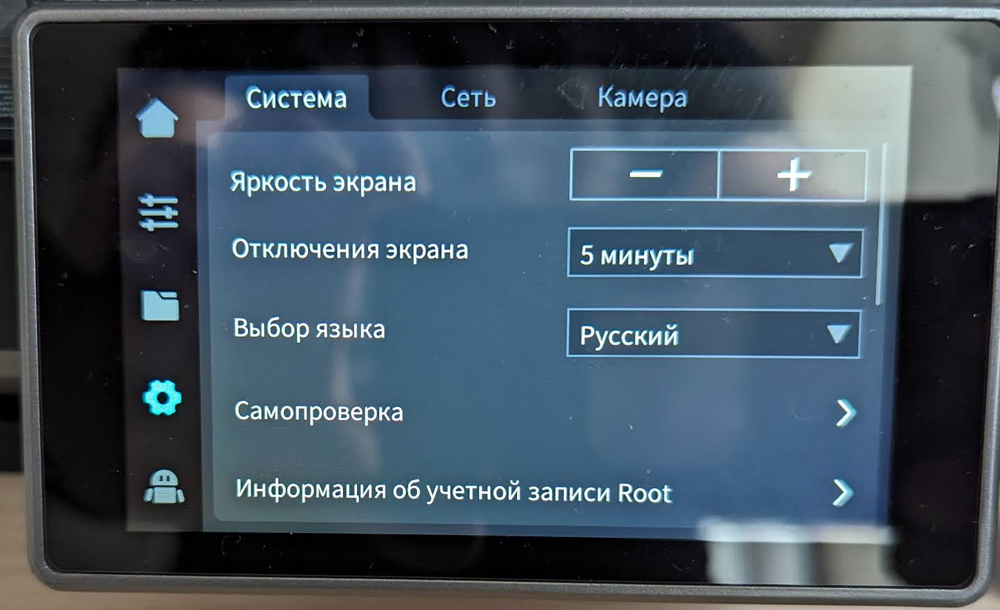
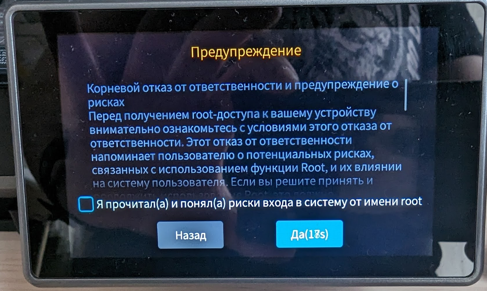
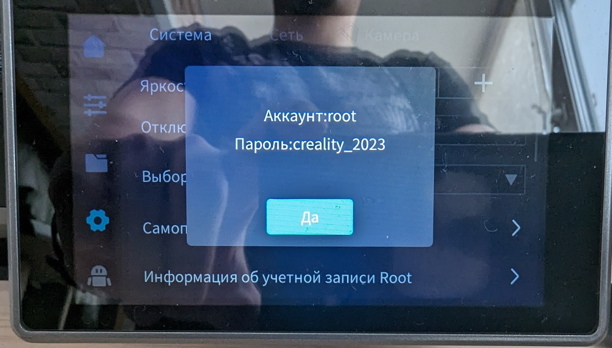

# Получение Root доступа

Для установки Moonraker, Fluidd, Mainsail и т.д, а так же для печати напрямую из Orca Slicer требуется получить Root доступ.

!!! warning 
    
    Если вас устраивает стоковый веб интерфейс и Creality Print, то крайне не рекомендуется получать Root.
    
Для получения root доступа достаточно перейти в настройки принтера и выбрать пункт "Информация об учетной записи Root"

На экране с подтверждением, ждем конца таймера, ставим галочку под пунктом "Я прочитал(а) и принял(а) риски входа в систему от имени root".

После появится логин и пароль для входа по SSH, обычно логин - `root`, пароль - `creality_2023`

Готово, после данных шагов можно подключиться к принтеру с помощью [SSH](ssh.md).