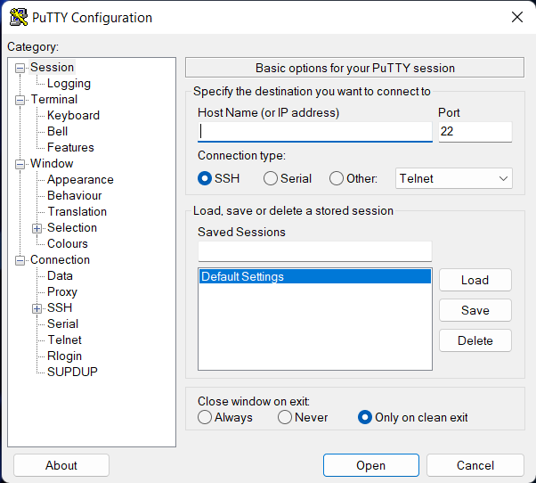
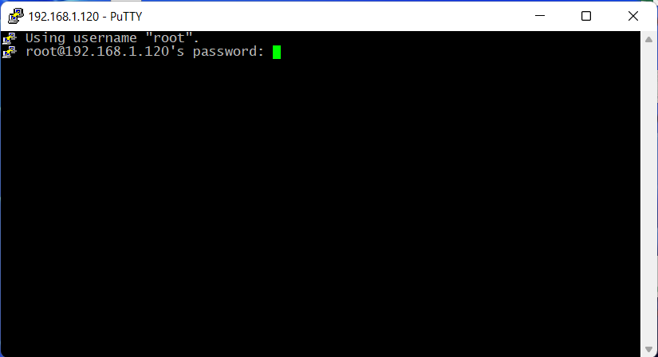
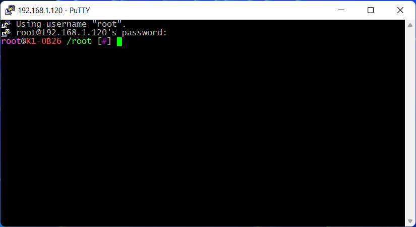

# Подключение к принтеру по SSH

После [получения root доступа](root.md), можно устанавливать сторонний веб интерфейс и остальные пользовательские модификации. 
Для этого требуется получить доступ к коммандной строке принтера через SSH. 

## SSH клиент для Windows

Для работы требуется скачать клиент [Putty](https://the.earth.li/~sgtatham/putty/latest/w64/putty.exe), он маленький, стабильный и не требует установки.
После установки и запуска откроется окно клиента.

Чтобы зайти на принтер, нужно ввести логин и IP принтера в строку "Host Name (or IP address)" в формате `<имя пользователя>@<ip адрес принтера>`. Например
`root@192.168.1.2`. 

!!! info
    IP адрес принтера можно посмотреть через экран, в настройках, в разделе "Сеть"

Рекомендуется сохранить настройки, чтобы не повторять ввод IP адреса каждый раз. Для этого введите в поле "Saved Sessions" название настроек и нажмите кнопку "Save"
В дальнейшем, чтобы загрузить сохраненный профиль, его нужно выбрать из списка и нажать кнопку "Load".
После ввода всех данных, для подключения к принтеру используйте кнопку "Open".

Если данные введены правильно, то откроется окно терминала, в котором нужно ввести пароль полученный при получении [root доступа](root.md).

При вводе пароля, он не будет отображаться, после ввода нажмите Enter для входа в консоль. Если пароль введен верно, то отобразится корневой каталог и появится возможность вводить команды.
Далее можно загружать Install Script и устанавливать Moonraker, Fluidd и Mainsail.

